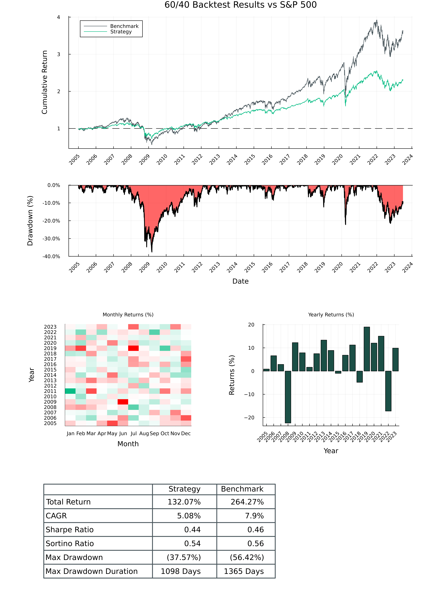
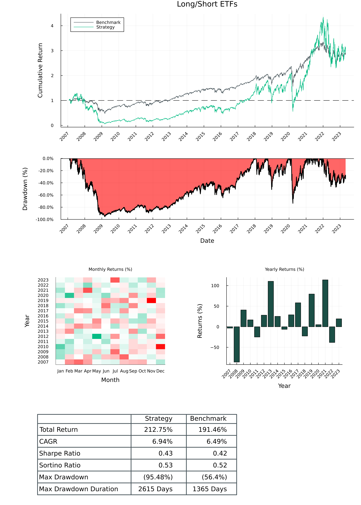
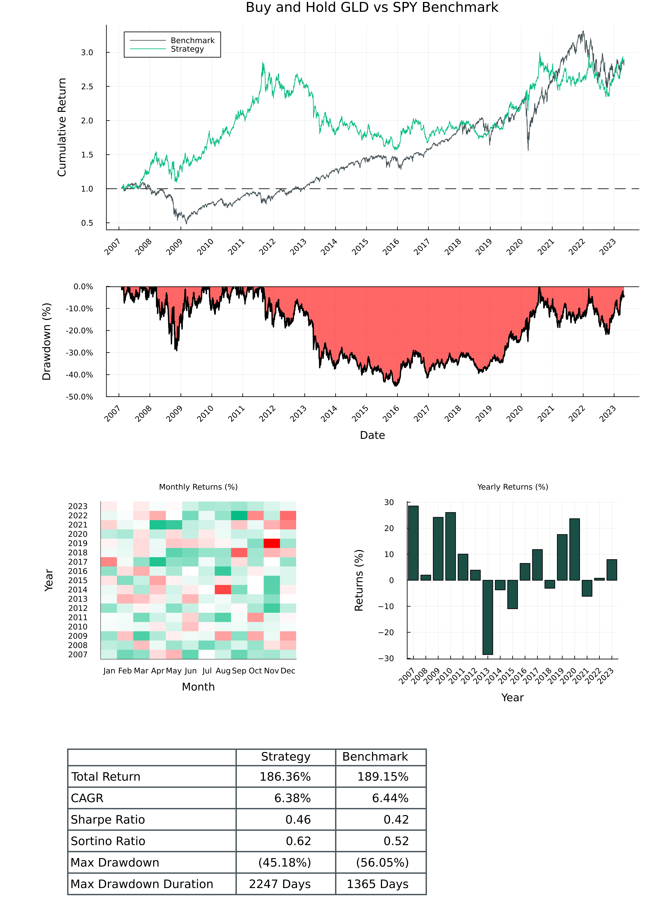

# Examples

# 60% Equities, 40% Bonds

```julia
# https://github.com/mhallsmoore/qstrader/blob/master/examples/sixty_forty.py
using CSV
using DataFrames
using Dates
using MarketData
using Plots
using SaguaroTrader
using SaguaroTraderResults

start_dt = DateTime(2005, 1, 1)
end_dt = DateTime(2023, 7, 1)
initial_cash = 100_000.0

# Download market data for SPY, AGG
if !isfile("./temp/AGG.csv") & !isfile("./temp/SPY.csv")
    download_market_data([:SPY, :AGG]; start_dt=DateTime(2004, 12, 25))
end

#####################################################
# Prepare broker
######################################################
# configure data source, portfolio optimizer
data_source = CSVDailyBarSource("./temp/")
data_handler = BacktestDataHandler([data_source])
port_optimizer = FixedWeightPortfolioOptimizer(data_handler)

# create exchange, broker
exchange = SimulatedExchange(start_dt)
broker = SimulatedBroker(start_dt, exchange, data_handler; initial_cash=initial_cash * 2)

#####################################################
# 60% SPY, 40% AAG (bonds)
######################################################

# construct asset universe, weights
assets = [Equity(:SPY), Equity(:AGG)]
universe = StaticUniverse(assets)
signal_weights = Dict(Equity(:SPY) => 0.6, Equity(:AGG) => 0.4)
alpha_model = FixedSignalsAlphaModel(signal_weights)

# Configure portfolio
portfolio_id = "sixty_forty"
create_portfolio!(broker, initial_cash; portfolio_id=portfolio_id)
order_sizer = DollarWeightedOrderSizer(0.001)
rebalance = BuyAndHoldRebalance(Date(start_dt))

# Run 60/40 backtest
strategy_trading_session = BacktestTradingSession(
    start_dt,
    end_dt,
    universe,
    broker,
    alpha_model,
    rebalance,
    portfolio_id,
    order_sizer,
    port_optimizer,
)
run!(strategy_trading_session)

#####################################################
# SPY Benchmark
######################################################
# Configure portfolio
portfolio_id = "spy_benchmark"
create_portfolio!(broker, initial_cash; portfolio_id=portfolio_id)

# configure weights, order sizer, rebalance frequency
signal_weights = Dict(Equity(:SPY) => 1.0)
alpha_model = FixedSignalsAlphaModel(signal_weights)
order_sizer = DollarWeightedOrderSizer(0.001)
rebalance = BuyAndHoldRebalance(Date(start_dt))

# Run SPY backtest
benchmark_trading_session = BacktestTradingSession(
    start_dt,
    end_dt,
    universe,
    broker,
    alpha_model,
    rebalance,
    portfolio_id,
    order_sizer,
    port_optimizer,
)
run!(benchmark_trading_session)

#####################################################
# Plot results
######################################################
plt_tearsheet = SaguaroTraderResults.plot_tearsheet(
    strategy_trading_session,
    benchmark_trading_session;
    title="60/40 Backtest Results vs S&P 500",
)
savefig(plt_tearsheet, "./sixty_forty.png")
```



# Long/Short

```julia
# https://github.com/mhallsmoore/qstrader/blob/master/examples/long_short.py
using CSV
using DataFrames
using Dates
using MarketData
using Plots
using SaguaroTrader
using SaguaroTraderResults

start_dt = DateTime(2007, 1, 31)
end_dt = DateTime(2023, 5, 1)
initial_cash = 100_000.0

# Download market data for SPY, AGG
if !isfile("./temp/AGG.csv") & !isfile("./temp/SPY.csv")
    download_market_data([:SPY, :AGG]; start_dt=DateTime(2006, 12, 25))
end

#####################################################
# Prepare broker
######################################################
# configure data source, portfolio optimizer
data_source = CSVDailyBarSource("./temp/", csv_symbols=[Symbol(:SPY), Symbol(:AGG)])
data_handler = BacktestDataHandler([data_source])
port_optimizer = FixedWeightPortfolioOptimizer(data_handler)

# create exchange, broker
exchange = SimulatedExchange(start_dt)
broker = SimulatedBroker(start_dt, exchange, data_handler; initial_cash=initial_cash * 2)

#####################################################
# 60% SPY, 40% AAG (bonds)
######################################################

# construct asset universe, weights
assets = [Equity(:SPY), Equity(:AGG)]
universe = StaticUniverse(assets)
signal_weights = Dict(Equity(:SPY) => 1.0, Equity(:AGG) => -0.7)
alpha_model = FixedSignalsAlphaModel(signal_weights)

# Configure portfolio
portfolio_id = "long_short"
create_portfolio!(broker, initial_cash; portfolio_id=portfolio_id)
order_sizer = LongShortOrderSizer(5.0)
rebalance = BuyAndHoldRebalance(Date(start_dt))

# Run 60/40 backtest
strategy_trading_session = BacktestTradingSession(
    start_dt,
    end_dt,
    universe,
    broker,
    alpha_model,
    rebalance,
    portfolio_id,
    order_sizer,
    port_optimizer,
)
run!(strategy_trading_session)

#####################################################
# SPY Benchmark
######################################################
# Configure portfolio
portfolio_id = "spy_benchmark"
create_portfolio!(broker, initial_cash; portfolio_id=portfolio_id)

assets = [Equity(:SPY)]
universe = StaticUniverse(assets)

data_source = CSVDailyBarSource("./temp/", csv_symbols=[Symbol(:SPY)])
data_handler = BacktestDataHandler([data_source])
port_optimizer = FixedWeightPortfolioOptimizer(data_handler)

# configure weights, order sizer, rebalance frequency
signal_weights = Dict(Equity(:SPY) => 1.0)
alpha_model = FixedSignalsAlphaModel(signal_weights)
order_sizer = DollarWeightedOrderSizer(0.001)
rebalance = BuyAndHoldRebalance(Date(start_dt))

# Run SPY backtest
benchmark_trading_session = BacktestTradingSession(
    start_dt,
    end_dt,
    universe,
    broker,
    alpha_model,
    rebalance,
    portfolio_id,
    order_sizer,
    port_optimizer,
)
run!(benchmark_trading_session)

#####################################################
# Plot results
######################################################
plt_tearsheet = SaguaroTraderResults.plot_tearsheet(
    strategy_trading_session,
    benchmark_trading_session;
    title="Long/Short ETFs",
)
savefig(plt_tearsheet, "./long_short.png")
```




# Buy and Hold

```julia
# https://github.com/mhallsmoore/qstrader/blob/master/examples/buy_and_hold.py
using CSV
using DataFrames
using Dates
using MarketData
using Plots
using SaguaroTrader
using SaguaroTraderResults

start_dt = DateTime(2007, 1, 31)
end_dt = DateTime(2023, 5, 1)
initial_cash = 100_000.0

# Download market data for GLD
if !isfile("./temp/GLD.csv")
    download_market_data([:GLD, :SPY]; start_dt=DateTime(2006, 12, 25))
end

#####################################################
# Prepare broker
######################################################
# configure data source, portfolio optimizer
data_source = CSVDailyBarSource("./temp/", csv_symbols=[Symbol(:GLD)])

data_handler = BacktestDataHandler([data_source])
port_optimizer = FixedWeightPortfolioOptimizer(data_handler)

# create exchange, broker
exchange = SimulatedExchange(start_dt)
broker = SimulatedBroker(start_dt, exchange, data_handler; initial_cash=initial_cash)

#####################################################
# 100% GLD (Gold ETF)
######################################################

# construct asset universe, weights
assets = [Equity(:GLD)]
universe = StaticUniverse(assets)
signal_weights = Dict(Equity(:GLD) => 1.0)
alpha_model = FixedSignalsAlphaModel(signal_weights)

# Configure portfolio
portfolio_id = "buy_and_hold"
create_portfolio!(broker, initial_cash; portfolio_id=portfolio_id)
order_sizer = DollarWeightedOrderSizer(0.01)
rebalance = BuyAndHoldRebalance(Date(start_dt))

# Run Buy and Hold backtest
strategy_trading_session = BacktestTradingSession(
    start_dt,
    end_dt,
    universe,
    broker,
    alpha_model,
    rebalance,
    portfolio_id,
    order_sizer,
    port_optimizer,
)
run!(strategy_trading_session)

#####################################################
# SPY Benchmark
######################################################

# Download market data for SPY
if !isfile("./temp/SPY.csv")
    download_market_data([:SPY]; start_dt=DateTime(2006, 12, 25))
end

data_source = CSVDailyBarSource("./temp/", csv_symbols=[Symbol(:SPY)])

data_handler = BacktestDataHandler([data_source])
port_optimizer = FixedWeightPortfolioOptimizer(data_handler)

# create exchange, broker
exchange = SimulatedExchange(start_dt)
broker = SimulatedBroker(start_dt, exchange, data_handler; initial_cash=initial_cash)

# Configure portfolio
portfolio_id = "spy_benchmark"
create_portfolio!(broker, initial_cash; portfolio_id=portfolio_id)

# configure weights, order sizer, rebalance frequency
signal_weights = Dict(Equity(:SPY) => 1.0)
alpha_model = FixedSignalsAlphaModel(signal_weights)
order_sizer = DollarWeightedOrderSizer(0.01)
rebalance = BuyAndHoldRebalance(Date(start_dt))

# Run SPY backtest
benchmark_trading_session = BacktestTradingSession(
    start_dt,
    end_dt,
    universe,
    broker,
    alpha_model,
    rebalance,
    portfolio_id,
    order_sizer,
    port_optimizer,
)
run!(benchmark_trading_session)

#####################################################
# Plot results
######################################################
plt_tearsheet = SaguaroTraderResults.plot_tearsheet(
    strategy_trading_session,
    benchmark_trading_session;
    title="Buy and Hold GLD vs SPY Benchmark",
)
savefig(plt_tearsheet, "./buy_and_hold.png")
```


