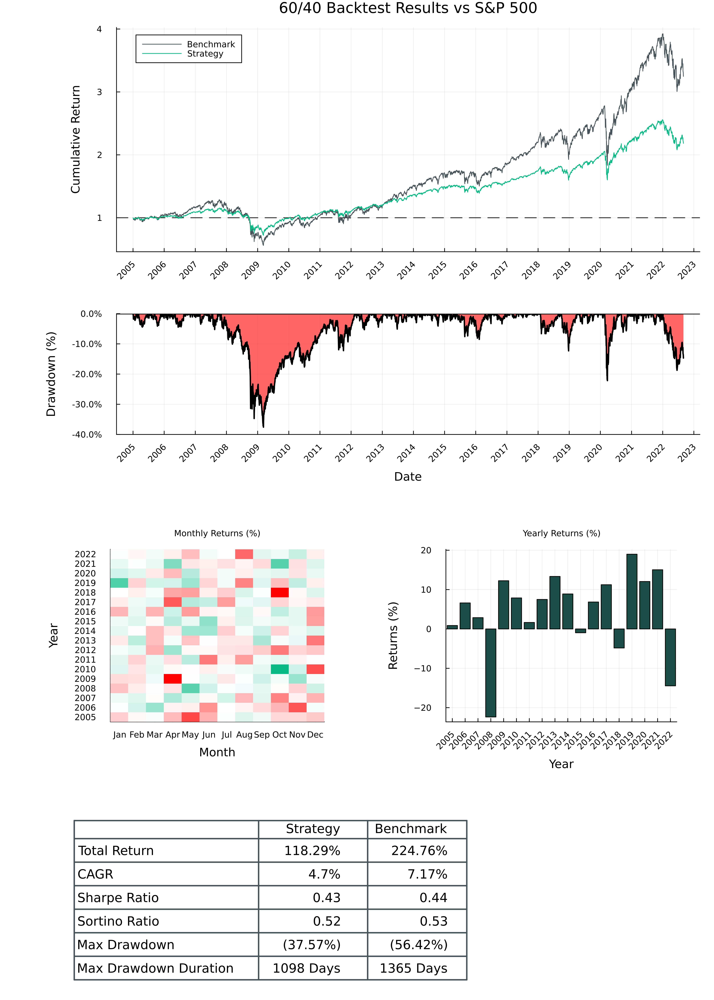

# Examples

# 60% Equities, 40% Bonds

```julia
# https://github.com/mhallsmoore/qstrader/blob/master/examples/sixty_forty.py
using SaguaroTrader
using SaguaroTraderResults
using CSV
using DataFrames
using MarketData
using Plots

start_dt = DateTime(2005, 1, 1)
end_dt = DateTime(2022, 9, 1)
initial_cash = 100_000.0

#####################################################
# Download market data
######################################################
function download_market_data(
    securities::Vector{Symbol},
    data_dir::String = "./temp/";
    start_dt::DateTime = DateTime(1990, 1, 1),
    end_dt::DateTime = DateTime(2040, 1, 1),
)
    if !isdir(data_dir)
        mkdir(data_dir)
    end
    for security in securities
        df = yahoo(security, YahooOpt(period1 = start_dt, period2 = end_dt)) |> DataFrame
        CSV.write(joinpath(data_dir, "$security.csv"), df)
    end
    return nothing
end


if !isfile("./temp/AGG.csv") & !isfile("./temp/SPY.csv")
    download_market_data([:SPY, :AGG]; start_dt = start_dt)
end

#####################################################
# Prepare broker
######################################################
# configure data source, portfolio optimizer
data_source = CSVDailyBarSource("./temp/")
data_handler = BacktestDataHandler([data_source])
port_optimizer = FixedWeightPortfolioOptimizer(data_handler)

# create exchange, broker
exchange = SimulatedExchange(start_dt)
broker = SimulatedBroker(start_dt, exchange, data_handler; initial_cash = initial_cash * 2)

#####################################################
# 60% SPY, 40% AAG (bonds)
######################################################

# construct asset universe, weights
assets = [Equity(:SPY), Equity(:AGG)]
universe = StaticUniverse(assets)
signal_weights = Dict(Equity(:SPY) => 0.6, Equity(:AGG) => 0.4)
alpha_model = FixedSignalsAlphaModel(signal_weights)

# Configure portfolio
create_portfolio!(broker, initial_cash; portfolio_id = "sixty_forty")
order_sizer = DollarWeightedOrderSizer(0.001)
rebalance = BuyAndHoldRebalance(Date(start_dt))

# Run 60/40 backtest
strategy_trading_session = BacktestTradingSession(
    start_dt,
    end_dt,
    universe,
    broker,
    alpha_model,
    rebalance,
    portfolio_id,
    order_sizer,
    port_optimizer,
)
run!(strategy_trading_session)

#####################################################
# SPY Benchmark
######################################################
# Configure portfolio
create_portfolio!(broker, initial_cash; portfolio_id = "spy_benchmark")

# configure weights, order sizer, rebalance frequency
signal_weights = Dict(Equity(:SPY) => 1.0)
alpha_model = FixedSignalsAlphaModel(signal_weights)
order_sizer = DollarWeightedOrderSizer(0.001)
rebalance = BuyAndHoldRebalance(Date(start_dt))

# Run SPY backtest
benchmark_trading_session = BacktestTradingSession(
    start_dt,
    end_dt,
    universe,
    broker,
    alpha_model,
    rebalance,
    portfolio_id,
    order_sizer,
    port_optimizer,
)
run!(benchmark_trading_session)


#####################################################
# Plot results
######################################################
plt_tearsheet = SaguaroTraderResults.plot_tearsheet(
    strategy_trading_session,
    benchmark_trading_session;
    title = "60/40 Backtest Results vs S&P 500",
)
savefig(plt_tearsheet, "./tearsheet.png")
```


